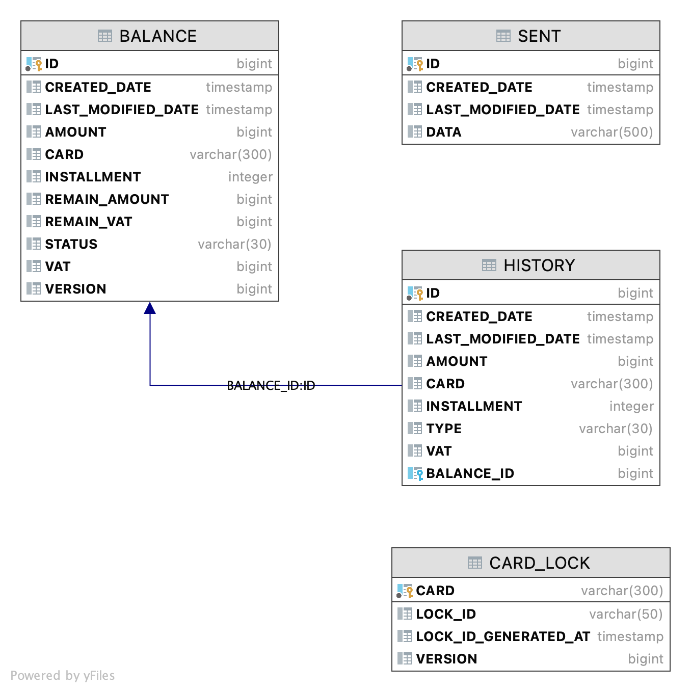

# 결제요청을 받아 카드사와 통신하는 인터페이스를 제공하는 결제시스템


## 개발 프레임워크

- Spring Boot
- Spring Data JPA
- H2 Database

## 테이블 설계



- BALANCE
    - 카드 결제 건 별 최초 승인 금액, 취소 처리 후 결재 잔액, 부가가치세 잔액

- HISTORY
    - 결재 / 요청 이력 저장

- SENT
    - 카드사에 전송된 데이터

- CARD_LOCK
    - 결제 요청시 Card 별 Lock 관리

## 문제해결 전략

- 결제 요청
    - 설명

- 취소 요청
    - 설명

- Multi Thread 처리
    - 설명

## 빌드 및 실행 방법

```
git clone https://github.com/NuBiFoRMs/card-payment.git
cd card-payment
gradle build
java -jar build/libs/card-payment-0.0.1-SNAPSHOT.jar
```

### Swagger UI

* [http://localhost:8080/swagger-ui.html](http://localhost:8080/swagger-ui.html)
